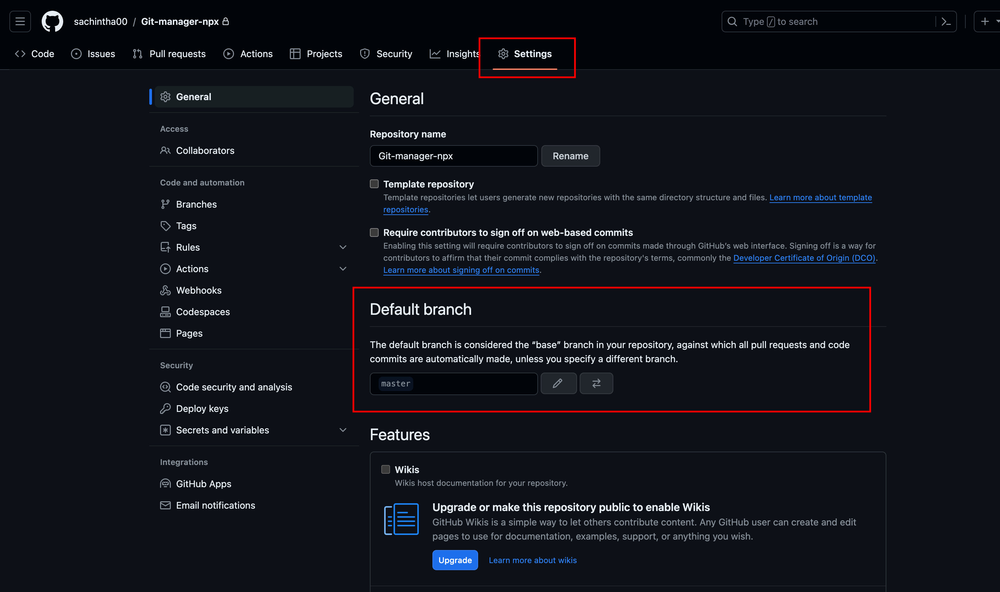

# GIT Wizard 🧙✨

GitWizard is your hassle-free companion for seamless Git workflows. Effortlessly manage branching, merging, squashing, releases, and commits with this user-friendly tool. Say goodbye to complexity and embrace a wizardly approach to professional Git workflows for developers.


## ❗️Be careful before use❗️

To ensure compatibility with your Git project, it's important to verify and, if necessary, update the branch name. Start by confirming the current branch name; if it's ```main```, proceed with the update.

Navigate to the ```Settings``` tab of your GitHub repository. Within the ```Repository``` section, locate the ```Default branch``` dropdown. If the current branch is ```main```, modify it to ```master```.

Once you've made this adjustment, scroll down to find the "Save changes" button and apply the update. Your Git project is now configured with the ```master``` branch.

If you encounter any challenges during this process, reference the attached screenshot for visual guidance.




## Features 🔥

- Light/dark mode toggle
- Live previews
- Fullscreen mode
- Cross platform


## Installation 🚀

 - If you wish to install this into your project, execute the following command:

    ```bash
    npm install git-wizard
    ```

    OR

    ```bash
    npm i git-wizard
    ```
    
 - For a global installation, utilize the following command:

    ```bash
    npm install -g git-wizard
    ```

    OR

    ```bash
    sudo npm install -g git-wizard
    ```

 - For usage without installation, follow this approach:

    ```bash
    npx git-wizard
    ```
## How to use❓

 - Begin by creating a branch named ```Dev``` based on the ```master``` branch, as illustrated below. Subsequently, push the newly created ```dev``` branch to the origin.

    

    You can use the following command to create and push the ```dev``` branch to the origin:
    ```bash
    git push --set-upstream origin dev
    ```

    This tool is visible within the ```dev``` branch, as illustrated below.

    

 - To initiate the development of a new feature, it is recommended to create a ```do``` branch off the ```dev``` branch, following the steps below:

    

    This tool is accessible within the ```do``` branch, as demonstrated below.

    

 - To address a bug fix, it is advisable to create a ```fix``` branch based on the ```master``` branch, following the steps outlined below:

    

    This tool is visible within the ```fix``` branch, as illustrated below.

    

 - Upon executing this in the ```master``` branch, you will encounter a menu resembling the one below.

    
## Author 👽

- [@Sachintha Madhawa](https://www.github.com/sachintha00)

